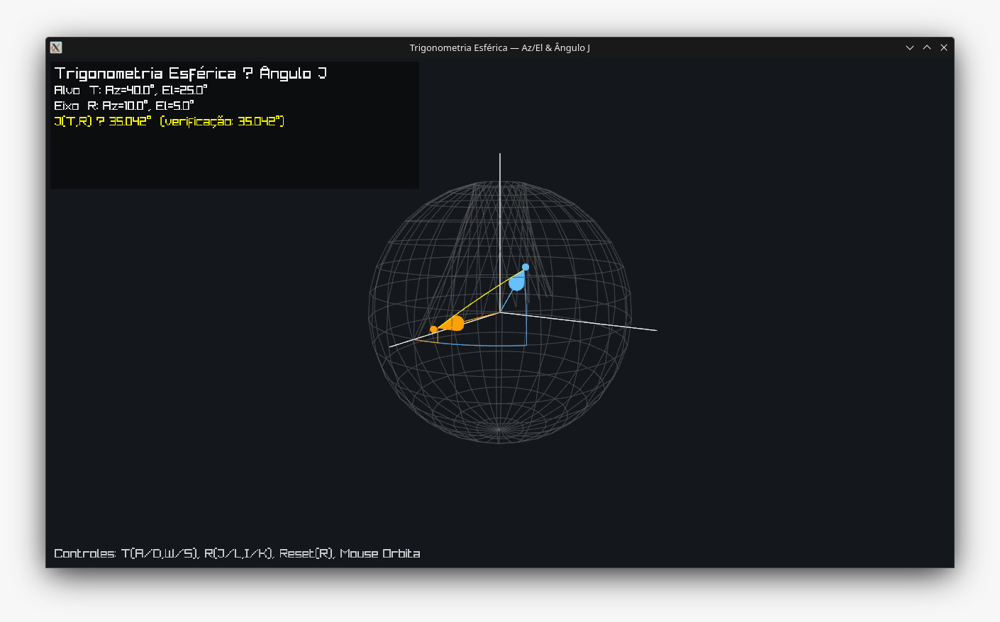

# TUTORIAL — Trigonometria Esférica aplicada a sensores em aeronaves

Este tutorial apresenta rapidamente como compilar, executar e interagir com o visualizador.

## 1) Compilar

Pré-requisitos no Linux:
- `build-essential` `cmake` `git`
- X11 e OpenGL: `libx11-dev libxrandr-dev libxi-dev libxinerama-dev libxcursor-dev` `mesa-common-dev libgl1-mesa-dev`

Passos:

```bash
cmake -S . -B build
cmake --build build -j
```

O executável será gerado como `build/spherical_trig`.

## 2) Executar

```bash
./build/spherical_trig
```

## 3) Conceitos e Interação

- O sistema define eixos N-E-Up como X (N), Y (E) e Z (Up).
- As direções do alvo (T) e do eixo de rolagem (R) são especificadas por Azimute (Az) e Elevação (El).
- Cada par (Az, El) é convertido em um vetor unitário 3D sobre a esfera unitária.
- O ângulo J é o ângulo de grande círculo entre T e R, calculado por produto escalar e validado por uma forma analítica da trigonometria esférica.

### Controles

- Alvo (T): A/D (Az −/+), W/S (El +/−)
- Eixo (R): J/L (Az −/+), I/K (El +/−)
- Reset: R
- Câmera: Botão direito do mouse para orbitar; scroll altera FOV

### Dica

- Use pequenos incrementos nos ângulos para observar a variação suave de J.
- Observe a coerência entre o valor de J via produto escalar e a verificação analítica.

---

## Repositório e imagem de referência

- Repositório no GitHub: https://github.com/ArvoreDosSaberes/Trigonometria_Esferica_Aeronaves

Imagem de apoio (adicione o arquivo na pasta `imgs/` para ser exibida):



## O que a imagem mostra

- Imagine uma **esfera unitária** centrada na aeronave (o nariz está em “N”).
- Há **dois vetores** desenhados sobre a esfera:

  - **T**: direção do **alvo** (definida por azimute $AZ_T$ e elevação $EL_T$).
  - **R**: direção do **eixo de rolagem** da aeronave (definida por $AZ_R$ e $EL_R$).
- A partir de $N$ (referência de azimute, “North”), os arcos horizontais **AZ$_T$** e **AZ$_R$** giram até os meridianos de T e R.
- As alturas **EL$_T$** e **EL$_R$** são os arcos em direção ao “vertical local” (seta **G**).
- O ângulo rotulado **$j$** é o **ângulo do alvo visto a partir do eixo de rolagem** — em outras palavras, o ângulo entre os vetores T e R medido pelo centro da esfera.

Os rótulos **C, D, E, F, f, h** indicam **arcos de triângulos esféricos retângulos**:

- Um triângulo no plano do alvo (envolvendo $AZ_T$ e $EL_T$).
- Outro no plano do eixo de rolagem (envolvendo $AZ_R$ e $EL_R$).
- Esses triângulos são “retos” porque um dos ângulos esféricos é de 90° (interseção entre meridiano e paralelo), o que permite usar as **Regras de Napier** para decompor projeções e complementos (co-elevações $f=90^\circ-EL_T$, $h=90^\circ-EL_R$, etc.).

### Cores no aplicativo (para corresponder à figura)

- Vetor **T** e arcos relacionados (AZ_T, EL_T): Azul-claro.
- Vetor **R** e arcos relacionados (AZ_R, EL_R): Laranja.
- Ângulo **j** (arco de grande círculo entre T e R): Amarelo.
- Esfera e eixos de referência: Cinza/Branco.

> Dica: ajuste Az/El de T e R e observe os arcos coloridos no espaço, reproduzindo as mesmas relações mostradas na figura `output.png` (e na imagem acima, quando disponível).

## Relação matemática principal (o que normalmente você quer extrair)

O ângulo $J$ (mesmo que $j$ na figura) entre T e R pode ser obtido direto da **lei dos cossenos esférica** — equivalente ao produto escalar de vetores unitários:

$$
\cos J
= \sin(EL_T)\sin(EL_R)
+ \cos(EL_T)\cos(EL_R)\cos\!\big(AZ_T - AZ_R\big)
$$

ou, em vetores cartesianos $\mathbf{\hat t}, \mathbf{\hat r}$,

$$
J=\arccos\!\left(\mathbf{\hat t}\cdot\mathbf{\hat r}\right).
$$

